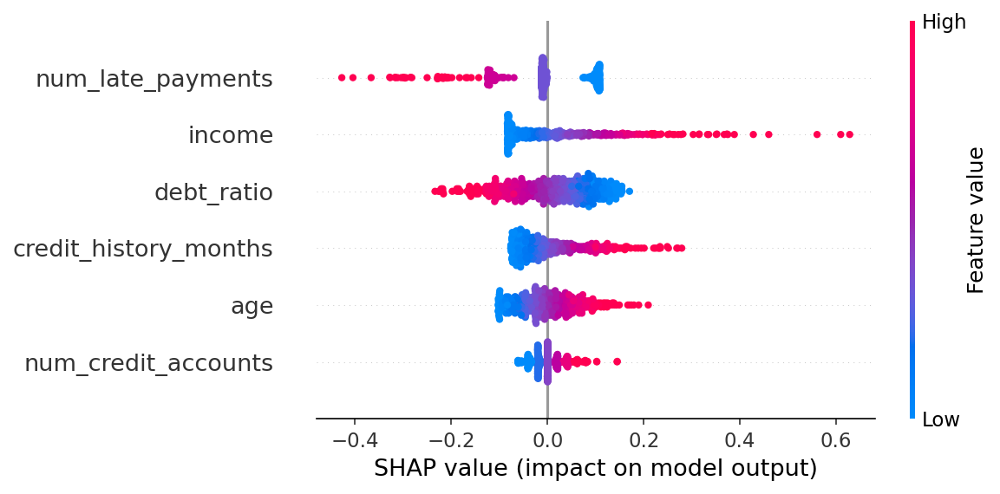
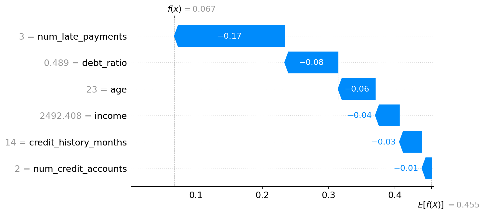
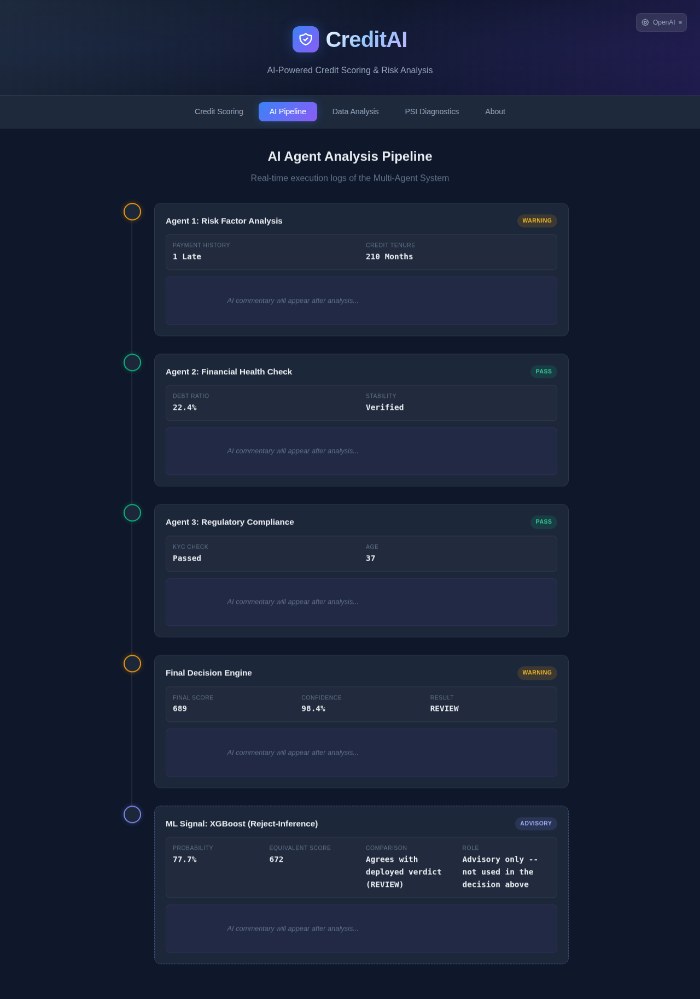

# Telco Credit Assessment Pipeline

This project builds a comprehensive End-to-End machine learning pipeline to assess the creditworthiness of applicants for telephone company subscriptions. It simulates the entire lifecycle of a credit scoring project from data generation to API deployment, including reject inference, population stability diagnostics, and interactive web dashboards.

## Project Structure

```
telco_credit_assessment/
├── creditai_app/             # Standalone interactive Streamlit web application
│   ├── .streamlit/           # Streamlit configuration & theme
│   ├── app.py                # Streamlit UI dashboard
│   ├── model.py              # Application scoring models & simulation logic
│   └── requirements.txt      # Streamlit app dependencies
├── data/
│   ├── raw/                  # Generated synthetic data
│   └── processed/            # Trained models and augmented datasets
├── reports/                  # Analysis reports and charts
├── src/
│   ├── generate_data.py            # Step 1: Generate synthetic telecom data
│   ├── generate_report.py          # Step 2: EDA and HTML report generation
│   ├── train_scoring_model.py      # Step 3: Train baseline Logistic Regression
│   ├── reject_inference.py         # Step 4: Concept proof of reject inference
│   ├── reject_inference_methods.py # Step 4-2: Compare Hard Cutoff, Fuzzy, Parceling
│   ├── ks_analysis.py              # Step 5: KS Analysis class and plotting
│   ├── final_comparison.py         # Step 6: Compare all models
│   ├── create_scorecard_policy.py  # Step 7: Create Scorecard and Policy Rules
│   ├── psi_analysis.py             # Step 7-2: PSI diagnostics (selection bias + score shift)
│   ├── gbm_comparison.py           # Step 7-3: GBM/RF/stacking vs. the logistic scorecard
│   ├── train_xgb_signal.py         # Step 7-4: Train the XGBoost reject-inference ML signal
│   ├── extract_xgb_params.py       # Step 7-5: Pickle -> src/xgb_model_params.json (with parity check)
│   ├── sync_xgb_params.py          # Step 7-6: JSON -> index.html's embedded JS tree walker
│   ├── app.py                      # Step 8: FastAPI Server
│   └── load_test.py                # Step 9: Load testing script
├── reject_inference_v3_stronger_bias_and_xgboost.py # V3 simulation: strong selection bias & XGBoost benchmark
└── pipeline_tab.png                # AI Pipeline architectural dashboard capture
```

## How to Run 

### 1. Interactive Streamlit App   https://creditai2.streamlit.app/
Run the full interactive web application locally:
```bash
cd creditai_app
pip install -r requirements.txt
streamlit run app.py
```
App will be accessible at `http://localhost:8501`.

### 2. Core Machine Learning Pipeline
Install dependencies and run the end-to-end training pipeline:
```bash
pip install pandas numpy scikit-learn matplotlib plotly joblib fastapi uvicorn requests pydantic xgboost

# 1. Generate Data
python src/generate_data.py

# 2. Generate EDA Report
python src/generate_report.py

# 3. Train Baseline Model
python src/train_scoring_model.py

# 4. Perform Reject Inference & Compare Methods
python src/reject_inference_methods.py

# 5. Create Final Scorecard & Policy
python src/create_scorecard_policy.py

# 6. PSI Diagnostics (selection bias + reject-inference method comparison)
python src/psi_analysis.py

# 7. Train the XGBoost ML signal and sync to client-side JS
python src/train_xgb_signal.py
python src/extract_xgb_params.py
python src/sync_xgb_params.py
python -m pytest tests/test_xgb_signal.py
```

### 3. Run FastAPI Server & Load Test
```bash
# Terminal 1: Start API Server
python src/app.py

# Terminal 2: Run Load Test
python src/load_test.py
```

## Key Results
- **Selected Method:** Parceling (or Hard Cutoff depending on run)
- **Max KS:** ~40-50%
- **Policy:** Auto-Approve (>= 600), Review (550-600), Reject (< 550)

### 🔍 Model Explainability (XAI)
To ensure transparency in our credit decisions, I implemented **SHAP** analysis:
- **Global Interpretation:** Visualized the primary drivers of default risk across the entire population.
- **Local Interpretation:** Provided clear "Reason Codes" for individual loan denials using Waterfall plots.


*Figure 1: Global feature importance showing the impact of variables on the model output.*


*Figure 2: Waterfall plot showing feature contributions for a specific prediction.*

### 📐 PSI: what it can and can't tell you

`src/psi_analysis.py` adds Population Stability Index (PSI) diagnostics on top of the reject-inference comparison, and is deliberately scoped to the two places PSI is actually a valid tool here:

1. **Selection bias** (`selection_bias_psi`) — PSI between the *raw feature* distributions of the approved vs. rejected populations. This answers "how different are the applicants we reject from the applicants we approve?", which is exactly the population-shift question PSI was designed for.
2. **Score shift** (`score_shift_psi`) — PSI between the accepts-only baseline model's score distribution and the score distribution each reject-inference method produces after retraining on its augmented data.

**What it's *not* used for, and why:** it's tempting to also run PSI on the *raw feature vectors* of each method's augmented training sample against the population, to compare Hard Cutoff vs. Fuzzy Augmentation vs. Parceling. That comparison is a trap. Fuzzy Augmentation and Parceling both reuse every rejected applicant's real, unmodified feature vector — they only differ in what target label (Fuzzy: soft weight; Parceling: a per-applicant Bernoulli draw from the score-bin bad rate) gets attached to it. So a feature-level PSI on the augmented rows reads ~0 for both methods by construction, no matter how differently they actually behave — it's tautological, not diagnostic.

The score-shift PSI is the non-tautological alternative: since it measures the model's *output* after retraining on each method's labels, it actually discriminates between the methods. In a typical run: Fuzzy Augmentation stays close to the baseline (PSI < 0.10, "Stable") because its soft/continuous weighting doesn't inject hard label noise, Hard Cutoff shows a moderate shift, and Parceling shows a severe shift (PSI > 0.25) because its per-applicant random draw adds real label noise on top of the same feature vectors.

Running `python src/psi_analysis.py` writes both tables to `reports/psi_analysis_report.txt` and a two-panel chart to `reports/psi_chart.png`.

### 🌲 ML Signal: XGBoost (reject-inference), shown *alongside* the verdict

The app's **AI Pipeline** tab now carries a fifth, visually distinct card next to Agents 1-3 and the Final Decision Engine: a second, independent opinion from an XGBoost model, trained on the parceling-augmented data from `reject_inference_methods.py`. It is deliberately **advisory only** — it does not feed `calculateScore()`, it cannot change an approval, and the card says so. `tests/test_xgb_signal.py` checks that structurally, not just by convention: `calculateScore()` is asserted not to call `xgbPredictProba()` at all.


*Figure 3: AI Pipeline tab displaying the multi-stage agent evaluation and advisory XGBoost signal.*

Two honest caveats, not glossed over:

- **It does not beat the deployed scorecard on this data.** `src/train_xgb_signal.py` evaluates it the same way `gbm_comparison.py` evaluates gradient boosting — on the approved population, split *before* reject inference runs, scored on the held-out half where outcomes were actually observed. Full numbers in `reports/xgb_signal_report.txt`.
- **Reject inference itself is not shown to help here.** `reports/reject_inference_truth_report.txt` scored parceling against this synthetic dataset's otherwise-unobservable true outcome for declined applicants, and parceling came out *worse* than doing no reject inference at all. A real deployment can't run that check — it needs a randomised approval slice — so the model ships as what reject inference produces, not as a proven improvement.

**How it gets from a `.pkl` to the browser:** the model is small on purpose (`max_depth=3`, 40 trees, ~600 nodes total) because it is dumped tree-by-tree into `src/xgb_model_params.json` (`extract_xgb_params.py`) and walked by a ~20-line JS function embedded in `index.html` (`sync_xgb_params.py`) — the same "generate the deployed copy, don't hand-type it" pattern `extract_model_params.py`/`sync_deployed_params.py` use for the logistic scorecard. The one subtlety a hand-written port would likely miss: XGBoost compares split thresholds at **float32** precision internally, so a JS walker comparing at full float64 precision disagrees right at a threshold that sits exactly on a training value. The fix is `Math.fround()` on both sides of every comparison; `tests/test_xgb_signal.py` extracts the literal `<script>` block from `index.html`, runs it in Node, and checks its output against `xgboost`'s own `predict_proba` on all 7,000 rows (max error < 1e-6) so this can't silently drift back.

---

### 🔬 Reject Inference V3: Stress-Testing Stronger Selection Bias & XGBoost

`reject_inference_v3_stronger_bias_and_xgboost.py` stress-tests reject inference under a more realistic **Missing Not At Random (MNAR)** scenario where approval decisions are tightly determined by risk-correlated features (reducing approval noise from $\sigma = 1.0$ in V2 to $\sigma = 0.25$ in V3), and directly compares Logistic Regression against XGBoost:

1. **Model Discrimination:**
   - **XGBoost decisively outperforms Logistic Regression:** True-population AUC jumps from **0.730** (LR baseline) to **0.764** (XGBoost baseline) with a DeLong test of $z = 10.66, p \approx 0$.
   - **KS Statistic:** Increases from **0.34** (LR) to **0.41** (XGBoost) — a +7 point gain, well above the 3–5 point jump typically considered a significant scorecard upgrade.
2. **Reject Inference Interaction:**
   - **Fuzzy Augmentation:** Tied with baseline XGBoost (AUC 0.767 vs 0.764, DeLong $p = 0.129$).
   - **Parceling Backfires with High-Capacity Models:** Pairing parceling with XGBoost degrades accuracy significantly ($p = 2 \times 10^{-6}$). Because parceling assigns noisier bin-averaged synthetic labels, flexible tree ensembles overfit this label noise, whereas simpler logistic models remain relatively resilient.
3. **Credit Swap-Set Analysis:**
   - At matched approval cutoffs, comparing the swap sets reveals XGBoost's tangible business impact:
     - 442 applicants approved by XGBoost but rejected by Logistic Regression had a **53.4%** true bad rate.
     - 442 applicants rejected by XGBoost but approved by Logistic Regression had a **70.4%** true bad rate (against a 39.9% population average).
     - XGBoost delivers direct credit portfolio loss reductions by effectively filtering out high-risk borrowers that linear models miss.
4. **Production Trade-offs:**
   - **Calibration:** Logistic Regression remains well-calibrated out of the box (predicted 0.751 vs 0.754 in the top decile), while XGBoost exhibits overconfidence (predicted 0.801 vs 0.726) and requires probability calibration (`CalibratedClassifierCV`) for pricing or cutoff setting.
   - **Explainability:** Logistic Regression offers native adverse action reason codes via coefficients, whereas production XGBoost implementations require SHAP-based reason code generators.

---

## A note on the data and the scale

The dataset is **synthetic**, generated by `src/generate_data.py`. Every figure in this
repository is therefore a property of a simulation and not a business outcome, and the
KS and PSI numbers should be read as evidence about the *methods* rather than about a
real book of loans.

The 300&ndash;850 score range is the familiar consumer-credit range, but the calibration
here is local to this model: **600 points is anchored at 5:1 odds of being good, and every
20 points doubles the odds.** Those three constants (`BASE_SCORE`, `PDO`, `BASE_ODDS` in
`index.html`, mirrored in `lambda_function.py`) define the whole scale. A score from this
model is not comparable to a bureau score that happens to use the same range.
